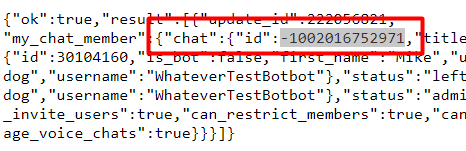

FAQ

Бот для отправки сообщений в канал. Работает на python3.10

1. Как получить id канала или группы?
- Добавить бота в группу, предварительно пректатив его работу
- Перейти по ссылке https://api.telegram.org/bot$TOKEN/getUpdates, где $TOKEN - токен бота
- Среди обновлений найти сообщение типа и скопировать id канала, не забыв минус перед ним (старые каналы могут быть без знака - )




Установка и работа бота:

Для работы требуется linux система с python3.10 и systemctl
Перенесите проект в папку
Перейдите в данную папку

Исправьте файл config.yaml согласно данным. Пример файла
```
telegram:
  token: 'xzcasd_asdasd' # токен бота
  group_id: '-111000111' # id каналя для отсылки
```

Установите требующиеся пакеты:
```
python3.10 -m pip install -r requirements.txt
```
Опубликуйте systemctl демона для работы. Для этого откройте файл сервиса и внесите в него данные
```
nano /lib/systemd/system/crpt_send.service
```
Пример данных:
```
[Unit]
Description=crpt_send
After=network-online.target
Wants=network-online.target

[Service]
Type=simple
WorkingDirectory=/pass-to-folder/ - путь к папке, где расположен проект
ExecStart=/usr/bin/python3.10 main.py
Restart=on-failure

[Install]
WantedBy=multi-user.target
```
Запустите проект
```
systemctl enable crpt_send && systemctl restart crpt_send